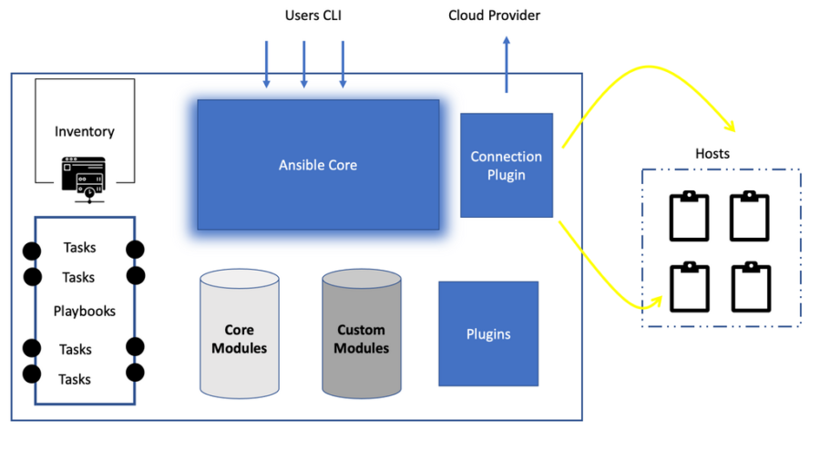
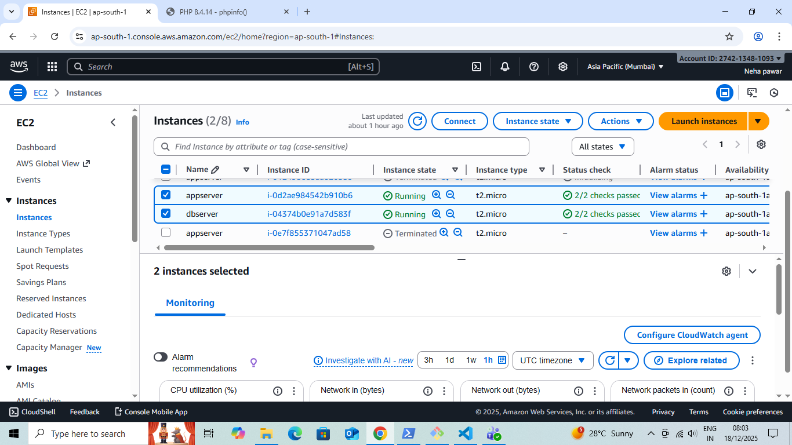
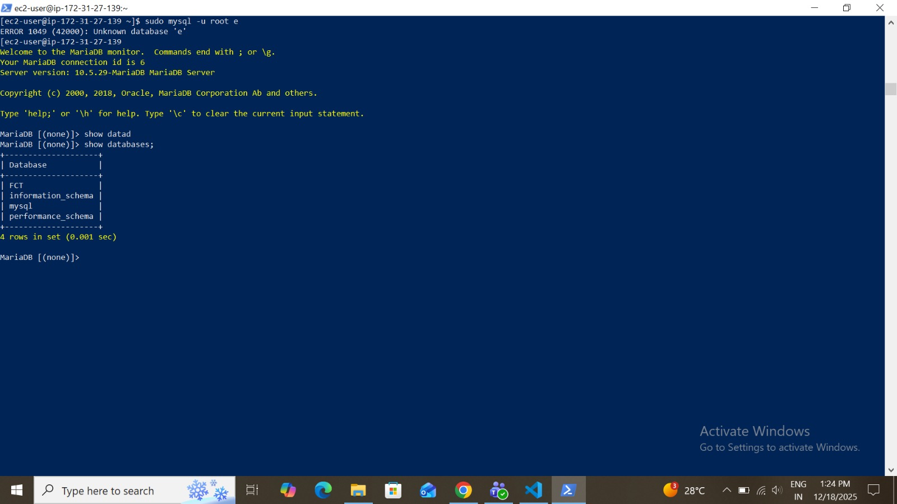
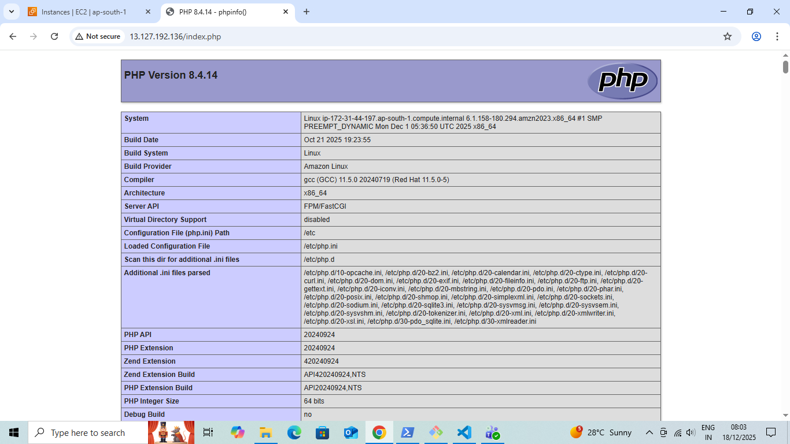

# 2-Tier Application Deployment using Ansible

##  Project Overview

This project demonstrates the deployment of a **2-tier web application** using a **single Ansible playbook**.

The architecture consists of:

* **App Server** → Nginx + PHP-FPM (Frontend)
* **Database Server** → MariaDB (Backend)

The entire setup is automated using Ansible, making the infrastructure **reproducible and idempotent**.

---

##  Architecture

```
User
  |
  v
Nginx + PHP-FPM  (App Server)
  |
  v
MariaDB          (DB Server)
```

---

##  Technologies Used

* Ansible
* Amazon Linux 2023
* Nginx
* PHP 8.x (PHP-FPM)
* MariaDB 10.5
* AWS EC2

---


---

##  Inventory Example

```ini
[appserver]
13.127.192.136

[dbserver]
172.31.39.92 
```

---

##  What the Playbook Does

### App Server Tasks

* Installs Nginx, PHP, PHP-FPM
* Starts and enables Nginx & PHP-FPM
* Deploys a PHP test page (`phpinfo()`)

### Database Server Tasks

* Installs MariaDB server
* Starts and enables MariaDB service
* Creates a database named `FCT`

---

##  How to Run the Playbook

```bash
ansible-playbook 2_tier.yml -i inventory.ini
```

---


### App Server Verification

Access the following URL in a browser:

```
http://<APP_SERVER_IP>/index.php
```

---
### Ec2 Instance:


### Database Verification

#### database-output


#### php-output:



---

##  Key Learnings

* Infrastructure automation using Ansible
* Multi-host deployment with a single playbook
* Clear separation of App and DB layers
* Idempotent and reproducible deployments

---

